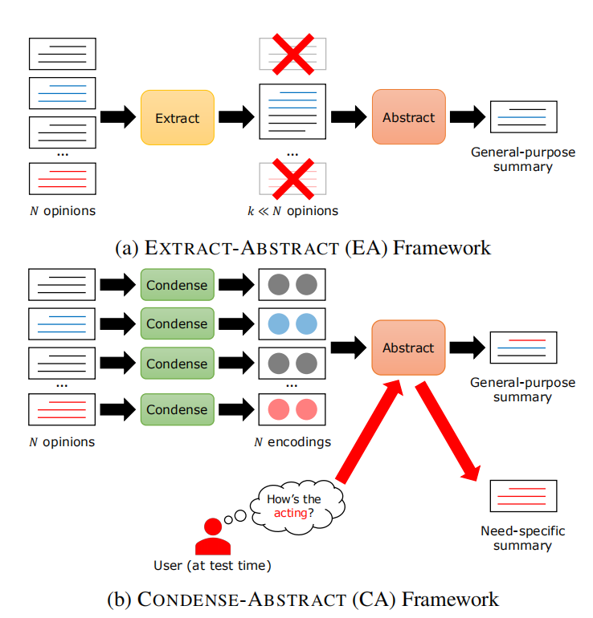

# Condense-Abstract-Model-for-opnion-summarization
## Paper share: Informative and Controllable Opinion Summarization

### 摘要
自动评论总结任务（例如电影、产品的评论）一般是基于神经网络的，通常来说是分为两步：第一步、利用Extract Model从大量评论中预选出重要的突出评论；第二步、利用Abstract Model基于预选出来的重要评论产生一个评论总结。Extract-Abstract Model（简称EA模型）的缺点是损失了大量信息并且无法灵活地根据用户的偏好生成某些有意向性的评论总结。 
本文提出了一个新的两步神经网络模型Condense-Abstract Model（简称CA模型），评论总结任务的本质是多源文本信息的转化，第一步利用Condense Model将所有相关评论压缩成多个稠密的向量作为第二步的输入，第二步利用Abstract Model生成评论总结。 
CA模型不仅解决了EA模型损失大量信息的问题，还可以通过引入一个简单的定制化的零数据工具，从而生成有特定偏好的评论总结。

### 介绍
CA模型运用在从多个评论文档中提取一个评论总结的场景。 
常见的EA模型和本文提出的CA模型的示意图如下: 

EA模型的第一步Extractive Model有两个缺点：信息损失和用户偏好无法纳入模型，而CA模型都有很好的改善这些问题。

### 方法
**Condense Model**
输入是N篇评论文档，一篇文档有M个词（每篇文档词的个数不一样），记为X={w_1,w_2,...,w_M}，通过一些预训练好的语言模型将这些词编码成词向量，通过Condense Model可以输出每篇文档的文档编码d，和词编码h_1,h_2,...,h_M

