# Condense-Abstract-Model-for-opnion-summarization
## Paper share: Informative and Controllable Opinion Summarization

### 摘要
自动评论总结任务（例如电影、产品的评论）一般是基于神经网络的，通常来说是分为两步：第一步、利用Extract Model从大量评论中预选出重要的突出评论；第二步、利用Abstract Model基于预选出来的重要评论产生一个评论总结。Extract-Abstract Model（简称EA模型）的缺点是损失了大量信息并且无法灵活地根据用户的偏好生成某些有意向性的评论总结。 
本文提出了一个新的两步神经网络模型Condense-Abstract Model（简称CA模型），评论总结任务的本质是多源文本信息的转化，第一步利用Condense Model将所有相关评论压缩成多个稠密的向量作为第二步的输入，第二步利用Abstract Model生成评论总结。 
CA模型不仅解决了EA模型损失大量信息的问题，还可以通过引入一个简单的定制化的零数据工具，从而生成有特定偏好的评论总结。

### 介绍
CA模型运用在从多个评论文档中提取一个评论总结的场景。 
常见的EA模型和本文提出的CA模型的示意图如下: 

EA模型的第一步Extractive Model有两个缺点：信息损失和用户偏好无法纳入模型，而CA模型都有很好的改善这些问题。

### 方法
#### Condense Model
输入：N篇评论文档，一篇文档有M个词（每篇文档词的个数不一样）
输出：N篇文档的文档编码，和词编码，。 

**1.word2vec** 
通过一些预训练好的语言模型将这些词编码成词向量 
记为) 

**2.Bi-LSTM Encoding** 
Bi-LSTM编码得到d和h 
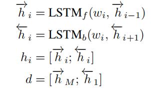 
其中和分别是向前LSTM和向后LSTM的隐层态。 

**3.LSTM解码** 
令初始隐层态 
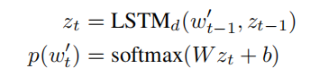 
其中词是由softmax生成的。 

**4.Training** 
训练使用最大似然损失函数 
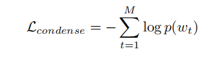 
我们通过训练模型参数，要使得当时，最大似然损失函数是最小的。 

#### Abstract Model
**1.Multi-source Fusion**  
本质：使用attentive pooling methodN对文档编码和词编码融合在一起，得到融合后的文档编码和词编码。 
记为的维数，权重向量参数   
文档编码的融合如下： 
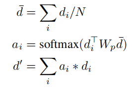 
其中是查询向量，是模型参数。 
词编码的融合如下： 
记V为N篇文档中所有词（排重后）的个数，为词在所有文档中出现的次数。 
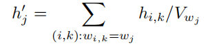 

**2.Decoder** 
使用LSTM decoder + attentive mechanism + copy mechanism模型 
*(1)LSTM* 
令初始隐层态 
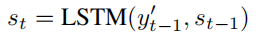 
*(2)attentive mechanism* 
在第t时间，引入attentive mechanism输出attention weight向量和上下文向量 
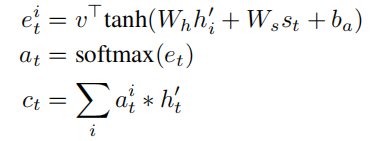 
*(3)copy mechanism* 
通过分别得到输出词的生成概率（generation probability）)和复制概率（copy probability）)，然后结合attention weight向量得到最终的词向量概率) 
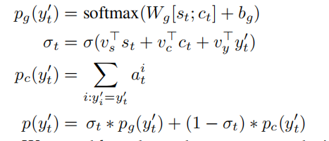 

**3.Salience-biased Extracts** 
模型现阶段为止还是把所有的文档一视同仁，但是有的文档更加重要，所以为了鼓励模型更重视重要的那些文档，我们直接加入了额外信息。 
*(1)预选k篇重要文档* 
通过 SUMMARUNNER方法（一种extractive model）预选出k篇重要文档，拼接成一个长序列 
*(2)Bi-LSTM encoder + LSTM decoder* 
对长序列进行BiLSTM encoding，输出的结果作为输入进行LSTM decoding，得到隐层态序列{} 
*(3)在Abstract Model - decoder - LSTM步骤中更新* 
令 
 
注意的是模型仍旧是把所有文档信息都纳入了模型，只不过更加重视那些重要的文档了。 

**4.Training** 
这个是一个有监督的模型训练过程，本身最优的评论总结为，但是通过代入概率)最小化最大似然损失函数： 
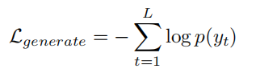 
除此之外，在Multi-source Fusion阶段，文章融合得到的文档编码需要同最优的评论总结y的condense模型结果z=Condense(y)尽量相等，因此这一步引入hinge损失函数，需要与z的距离近，而离其他任意的随机评论总结的condense模型结果向量（记为）远，在这里选了5个任意随机评论总结。 
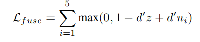 
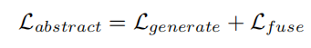 

#### Zero-shot Customization
这个模型还有一个优点就是可以根据用户的偏好来生成评论总结，这里只需要修改一小步。 
在Multi-source Fusion 步骤中首先要得到一个查询向量，原本模型是利用所有文档编码求平均得到的，现在只需要引入一些有背景信息的评论文档（例如，想要生成一篇有正向情绪的评论总结，就增加一些有正向情绪的评论）。 
记是这些有背景信息的评论文档的集合，则，就代替了成为新的查询向量，从而实现了用户偏好的实现。

### 总结
从效果上看，CA效果比EA模型好，信息量更多，zero-shot customization technique 在测试中也能够很好的产生情绪相关或者概况相关的评论总结。 
在未来上，CA模型需要尝试在不同的多文档总结的任务，并且尝试开发半监督或者无监督的方法。

